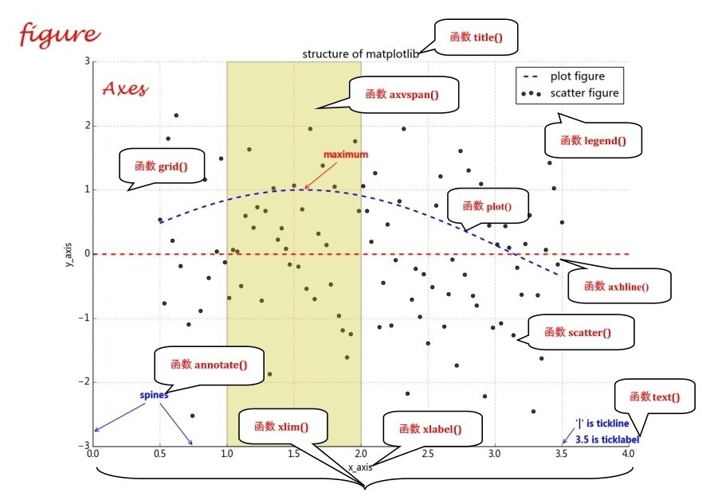

# matplotlib实现数据可视化

## 学习目的
- 毕设画图展示
## matplotlib如何组织内容
在一个图形输出窗口中，底层是一个Figure实例，即画布。画布上是图形，即Axes实例，Axes实例几乎包含了组标轴、刻度、标签、线和标记等。
Axes实例有x轴和y轴属性，可以使用Axes.xaxis和Axes.yaxis来控制x轴和y轴的相关组成元素


## 代码中学习画图
```python
import  matplotlib.pyplot as plt
import numpy as np
x = np.linspace(0.5, 3.5, 100)
y = np.sin(x)
plt.plot(x,y,ls='-',lw=2,label='plot')  # ls:线条风格 lw:线条宽度 label：标记图像内容的标签文本，需plt.legend()
plt.scatter(x,y, c="g",label='scatter')  #c：颜色
plt.legend()    #显示图例
plt.savefig('./image/xxx.png')  #保存图片到指定路径
plt.xlim(0,1)   #坐标轴数值显示范围
plt.ylim(0,1)
plt.xlabel("x轴的标签文本")
plt.ylabel("y轴的标签文本")
plt.grid(linestyle=":",color="r")   #linestyle:网格线的线条风格 color:颜色
plt.axhline(y=4,c='r',ls='--',lw=2) #绘制平行于坐标轴的参考线
plt.axhline(x=6,c='r',ls='--',lw=2)
plt.axvspan(xmin=4.0,xmax=6.0,facecolor="y",alpha=0.3)  #绘制垂直于坐标轴的参考区域
plt.axvspan(ymin=0.0,max=0.5,facecolor="y",alpha=0.3)   #参数含义：起始位置、终止位置、颜色、透明度
plt.show()
plt.close()
```
